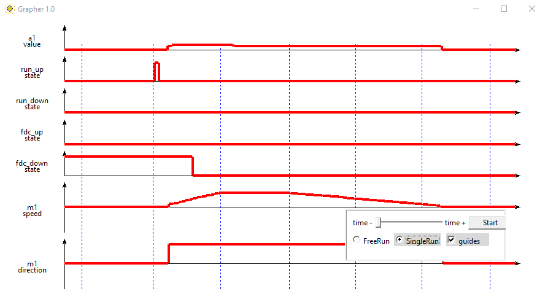
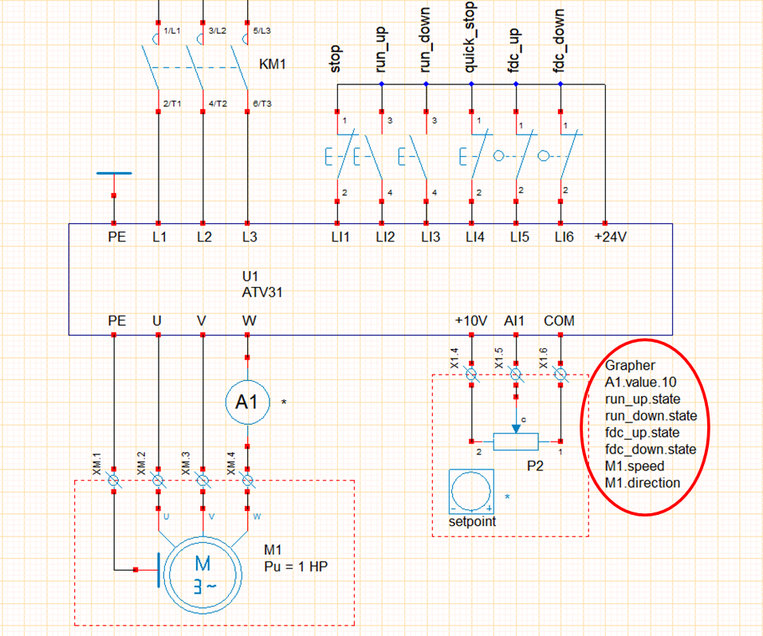
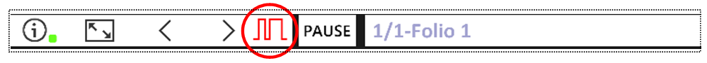

# Grapher

This module allows you to draw a chronogram (up to 16 variables) during simulation:

- You must first prepare the list of variables to be displayed in a text zone edited in WinRelais, for example :

(**us19 - demo_Speed_Drive_ATV31_3ph_3C**)

- The first line of the text box must begin with the keyword **Grapher**,
- this text box can be placed anywhere in the layout,
- a specific icon appears during simulation if the **Grapher** text zone is detected,

- variable order determines chronogram display order,
- the syntax used to define a variable is : **name_object.control[.caliber]**

| control|description |example|
| -------------- | ------------ |----------------|
|state|status active/not active|fdc_haut.state : status of high limit switch|
|speed|motor object speed|M1.speed : M1 motor speed|
|direction|sense of rotation motor object|M1.rotation : direction of rotation of motor M1|
|value.caliber|measured value and caliber|A1.value.10:current measured by ammeter A1 calibrated 10A|

