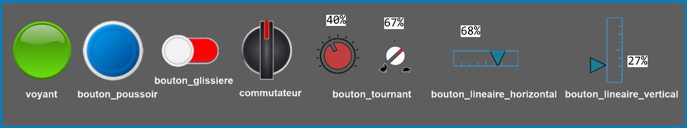
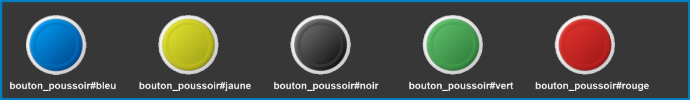
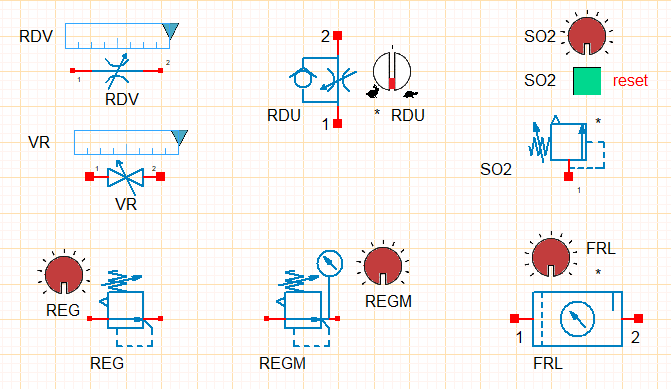
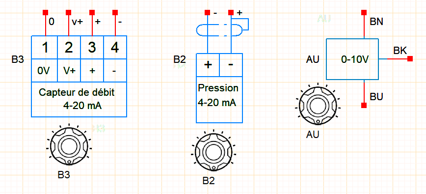
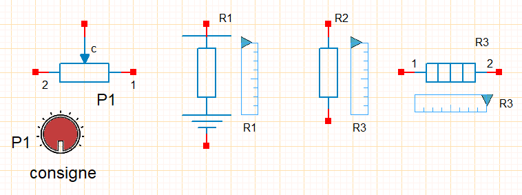

# Human Machine Interface

- hmi components can be modified in WinSymbole.
- Variants of ihm components can be created by adding the suffix **#my variant** after the component root. Example:

## Light
|voyant|library /_hmi|
| -------------- | --------------------------------------------- |
|texture_name =|foreground texture in png format|
|texture_name2 =|optional background texture in png format|

## Push button / Slide button

|pushbutton, slide_button |library /_hmi|
| -------------- | --------------------------------------------- |
|hooking =|False/True|
|texture_name =|foreground texture in png format|
|texture_name2 =|optional background texture in png format|
|state =|fixes active/non-active button state, only if snap = True|

## Switch
|switch_2pos, switch_3pos |library /_hmi|
| -------------- | --------------------------------------------- |
|hooking =| False/True|
|texture_name =|foreground texture in png format|
|texture_name2 =|optional background texture in png format|
|state =|0,1,2: switch position, only if snap = True|

## Potentiometer
|rotating_knob, horizontal_linear_knob, vertical_linear_knob|library /_hmi|
| -------------- | --------------------------------------------- |
|alpha =|[0 to 100%]|
|texture_name =|foreground texture in png format|
|texture_name2 =|optional background texture in png format|
|*|fixes the display position of the % set by the button|

## Composition

Adjustable simulable components must be associated with an ihm component.

- Library **_divers_pneumatic** :

- Library **_sensors**

- Library **_resistors**
        - The association of an ihm component is not mandatory for resistor components.

