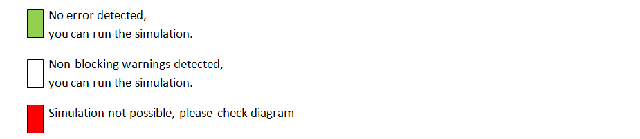

# Home

| | |
| -------------- | --------------------------------------------- |
| **Revision 4** | **september 2025** |
| Software | WRSimulator|
| Version | 1.6 on WinRelay Studio 2.5.2 (2.5g) |
| Editor | INGEREA |

## Simulator objectives

The aim of the simulator is to enable users to simulate electrical, electrotechnical and pneumatic circuits for educational purposes and for pre-project presentation.

In particular, the simulator can be used to simulate automated production system-type installations using a virtual or physical PLC connected via MODBUS/TCP-IP, coupled with an animated operating section.

The simulator incorporates a mixed analog/digital simulation model, enabling simultaneous simulation of:
- standard electrical/electrotechnical circuits,
- pneumatic circuits,
- complex objects (speed controllers, safety relays, etc.)
- programmable logic controllers,
- simple operating parts.

## First steps
### Open an example
- Open an example from WinRelais **File>Open wr-schematic/Simulator_Demos/**.
- A **quick access** to the **Simulator_Demos** folder is built into the installation.
This allows you to launch WinRelais directly with the selected example.

### Launch simulator
Click on the icon:

### Simulator controls
- Simulator checks give three levels of warning:

[Warning list](errors.md)

