# Simulable library

## Access

WinRelais exposes the library of simulatable components (folder D4) using three methods:

The explorer provides easy access to the blocks_simulables folder, which can be used to retrieve complete simulation subsets:
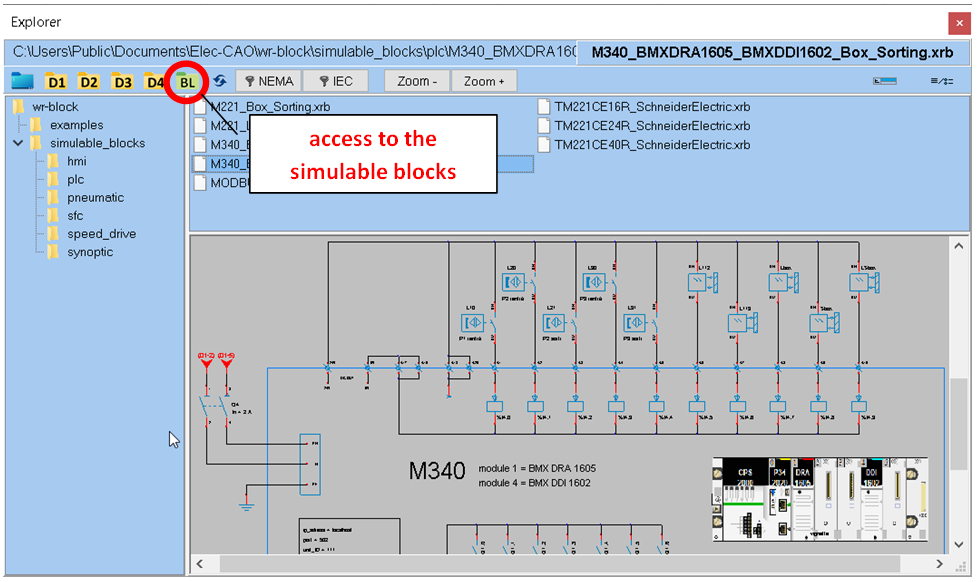

### Method 1: place a symbol
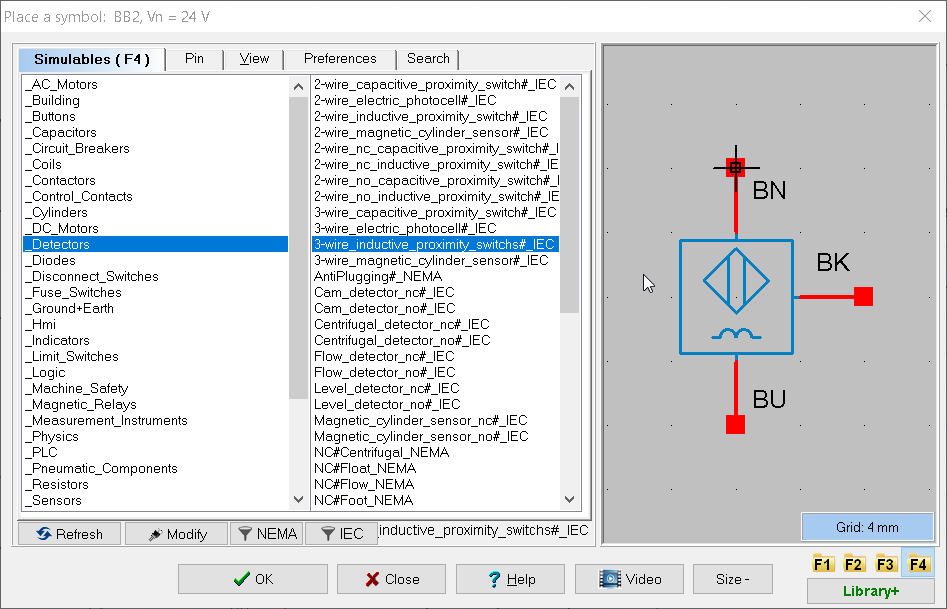
### Method 2: search and place a symbol
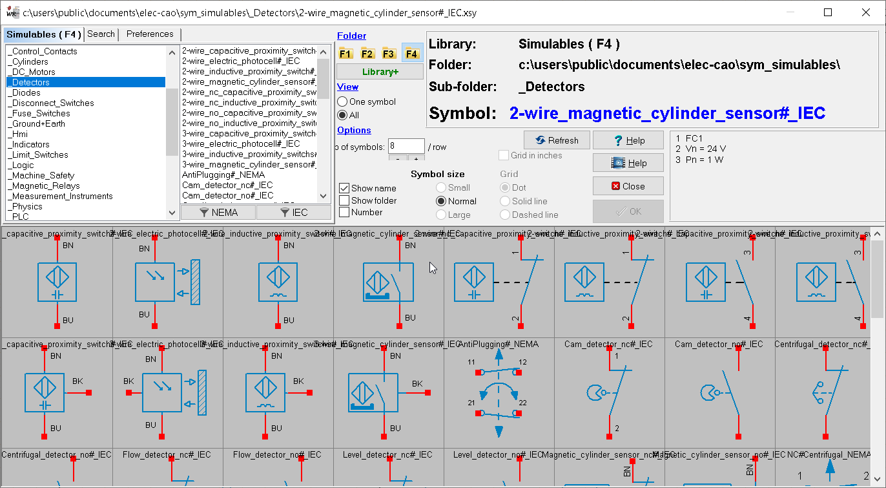
### Method 3: explore and place a symbol using drag & drop
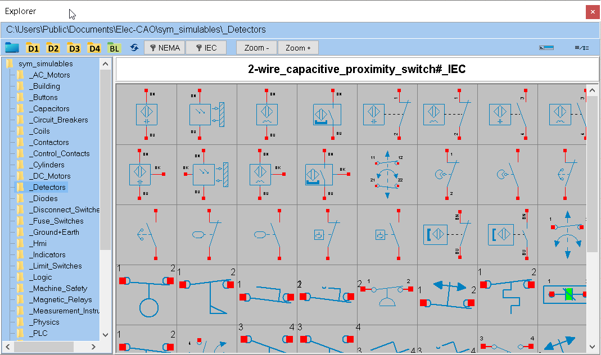

## Create a symbol from an existing symbol

You can create a new symbol from an existing one, adapting its design and terminal layout as required. The new symbol inherits all the simulation logic of the parent symbol.
The visual of the symbol can be defined with WinSymbol or with an image (also called texture) in png format.

**Constraints** :

- Pin names must not be modified.
- The number of pins may not be changed.

**Example 1**: We want to create a square-shaped ammeter symbol.

1. Place the 'amperemeter' symbol on the folio.
2. Go to Modify a Symbol and select Run WinSymbol.
3. Modify the symbol as required in WinSymbol. Save modification (Ctrl-S).
4. Accept the modifications.
5. Save the symbol in the '\_MeasuringInstruments' library, naming it 'amperemeter**\#**carre'.
(Do not use accented characters to name symbols).

It's very important to keep the same starting name, 'amperemeter' in the example, then add the '**\#**' character followed by the name of your choice.
The '**\#**' symbol tells the simulator that the new 'carre' symbol is a variation of the 'amperemeter' symbol.

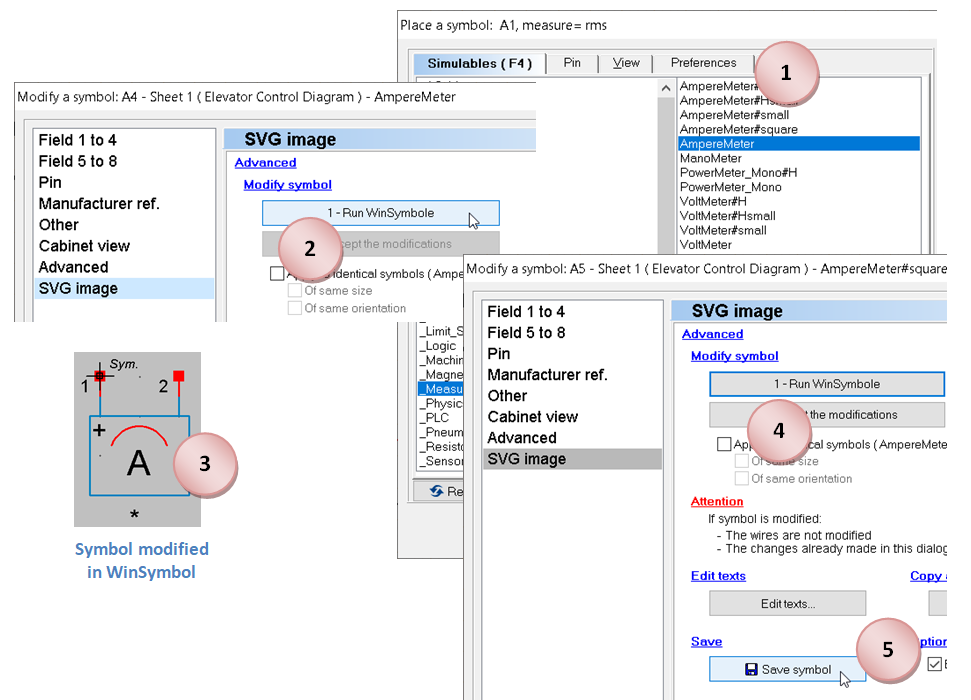

**Example 2**: We'd like to add a solenoid valve symbol to the
family, which we'll call '**Solenoid_Valve#1**'.

The operation takes longer than in the previous example, as the symbol's drawing must be created when it is active. Active symbol drawings are stored in the file :
**C:\Users\\Public\Documents\Elec-CAO\wrs-data\wrs-on-symbols.xrs**

1. Place the '**Solenoid_Valve**' symbol from the '**\_Coils'** family on the folio.
2. Modify the symbol as described in points 2.3 and 4 of example 1.
3. Save the symbol in the ''**\_Coils**'' library, naming it '**Solenoid_Valve#1**'.
4. Open the schematic '**wrs-on-symbols.xrs'** in WinRelais. Preferably select the '\_Coils' folio.
5. Place the newly saved symbol '**Solenoid_Valve#1**' on the folio.
6. Go to Modify Symbol.
7. Modify the symbol as required in WinSymbol. Save modification (Ctrl-S).
8. Accept the modifications.
9. Save schematic as '**wrs-on-symbols.xrs**'.

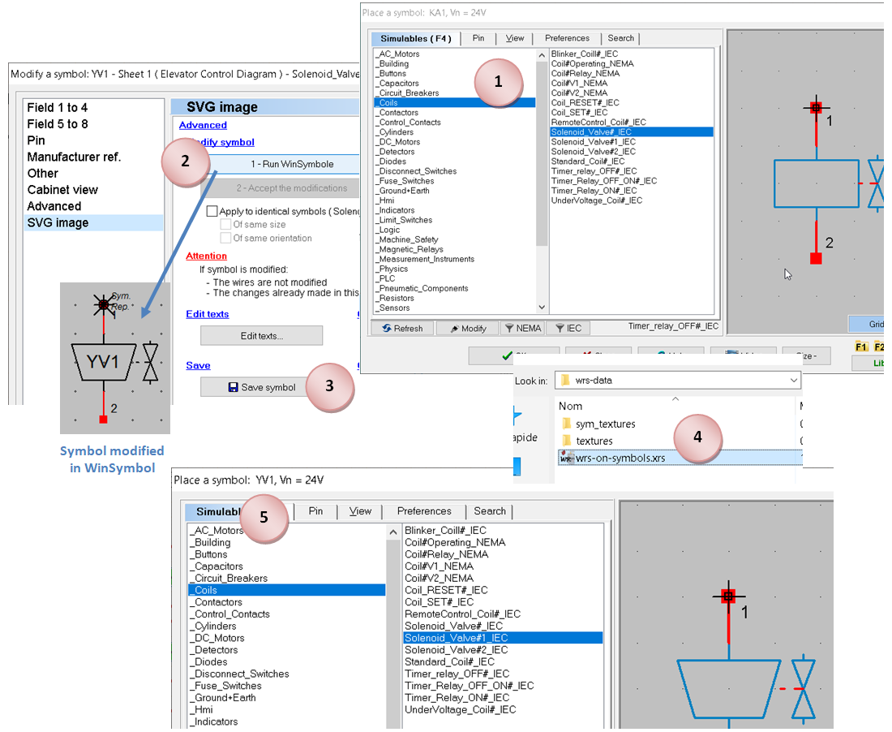
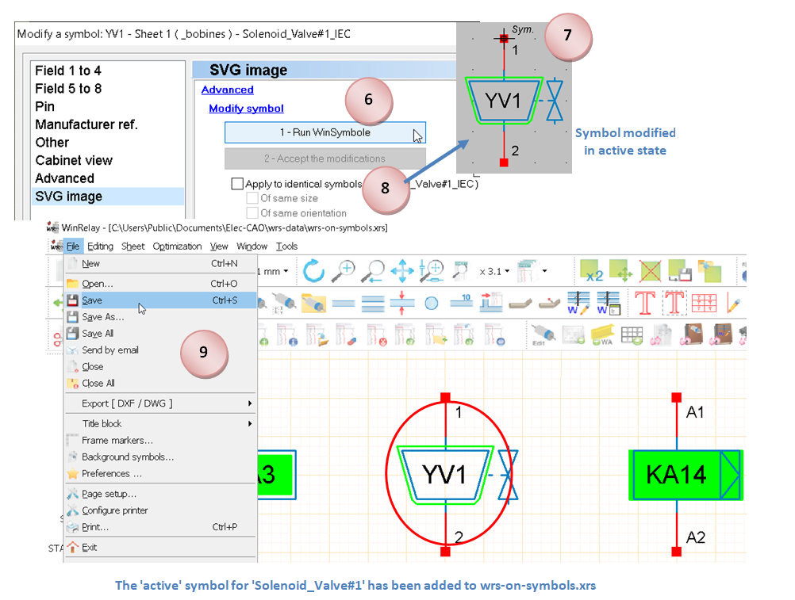

**Example 3**: Using a png image to create the visual for a solenoid valve, which will be named '**Solenoid_Valve#2**'.

We may find that WinSymbol's drawing capabilities are not sufficient to create the visuals for the symbols. In this case, it's possible to use a texture that will be edited in a separate program.
The visual of the initial 'electrovalve' object manipulated earlier is constructed with this texture:

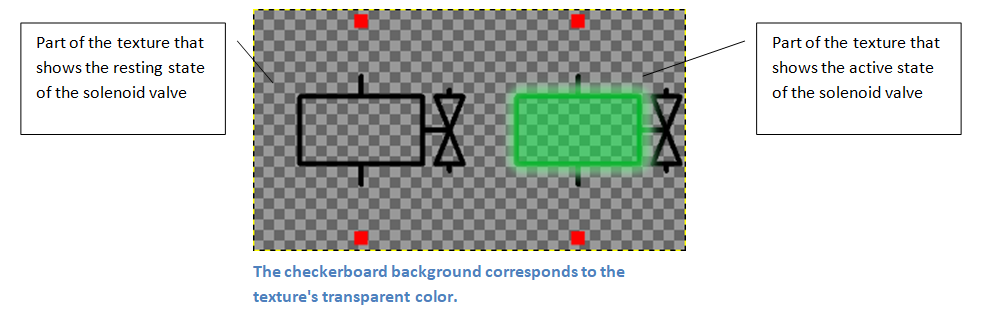

**The texture must have the same name as the object.**

1. Place the '**Solenoid_Valve**' symbol of the '**\_Coils'** family on the folio.
2. Save the symbol in the ''**\_Coils**' library, naming it '**Solenoid_Valve#2**'.
3. Access the 'Solenoid_Valve.png' texture in the folder:
   **C:\Us\Public\Documents\Elec-CAO\wrs-data\sym_textures\\_Coils\Solenoid_Valve.png**
4. Copy the texture renamed to '**Solenoid_Valve#2.png'** into the same folder.
5. Edit the '**Solenoid_Valve#2.png'** texture in a suitable program (e.g. GIMP) as required, then save (command 'Overwrite Solenoid_Valve#2.png' with GIMP).

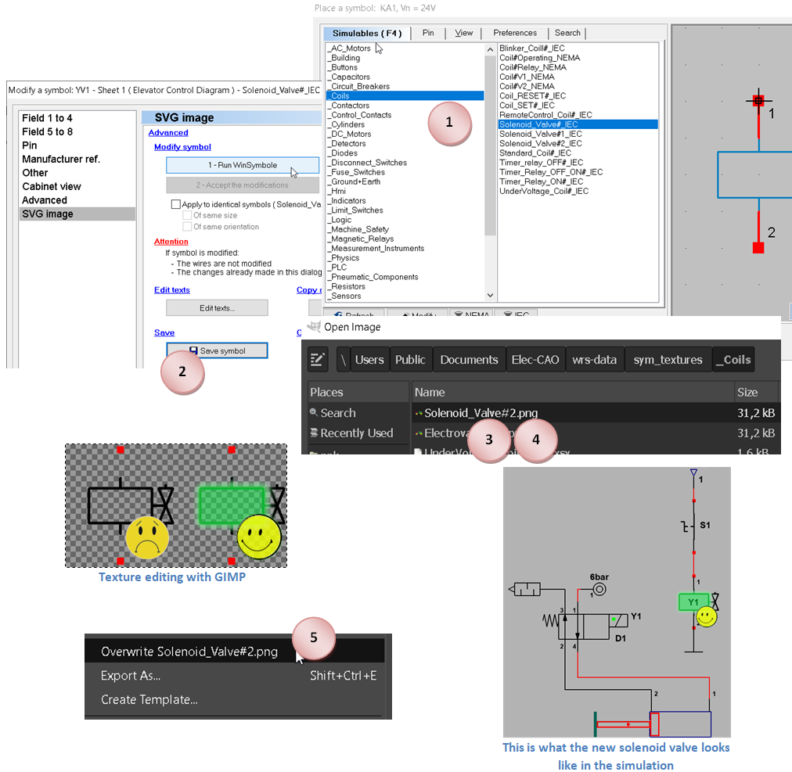

## Drawing mode(s) by symbol family
| | |
| -------------- | --------------------------------------------- |
|Drawing mode(s) by symbol family|
|\_Terminals|Texture or WinSymbol|
|\_Buildings|WinSymbol only|
|\_Buttons|Texture or WinSymbol|
|\_Capacitors|WinSymbol only|
|\_Circuit_breakers|WinSymbol only|
|\_Coils|Texture or WinSymbol|
|\_Contactors|WinSymbol only|
|\_Control_Contacts|Texture or WinSymbol|
|\_Cylinders|WinSymbol only|

|\_DC_Motors|WinSymbol only|
|\_Detectors|Texture or WinSymbol|
|\_Diodes|WinSymbol only|
|\_Disconnect_Switches|WinSymbol only|
|\_Fuse_Switches|WinSymbol only|
|\_Ground+Earth|WinSymbol only|
|\_Hmi|Texture or WinSymbol|
|\_Indicators|Texture or WinSymbol|
|\_Limit_Switches|Texture or WinSymbol|
|\_Logic|WinSymbol only|
|\_Machine_Safety|WinSymbol only|
|\_Magnetic_Relays|WinSymbol only|
|\_Measurement_Instruments|WinSymbol only|
|\_PLC|WinSymbol only|
|\_Pneumatic_Components|WinSymbol only|
|\_Resistors|WinSymbol only|
|\_Sensors|WinSymbol only|
|\_Sfc|WinSymbol only|
|\_Speed_Drives|WinSymbol only|
|\_Supplies|WinSymbol only|
|\_Synoptic|Texture or WinSymbol|
|\_Terminals|Texture or WinSymbol|
|\_Thermal_Relays|WinSymbol only|
|\_Transformers|WinSymbol only|
|\_Valves|WinSymbol only|

- A symbol with the default design mode 'WinSymbol' can be transformed into another symbol using WinSymbol only.
- A symbol with the default drawing mode 'Texture' can be transformed into another symbol with a modified texture, or with a WinSymbol description.

## General component settings
(available in 'Modify an object' in WinRelais)

| Relay, Timer, Timer|Library \_Coils|
| -------------- |------|
|vn = |coil voltage [12 to 230 V]|
|pn = |rated power \[12 to 230 V\]|
|toff = |deactivation delay \[0 to 30 s\]|
|ton = |activation delay \[0 to 30 s\]|

| timed contacts|library \_contacts_commande|
| -------------- |---|
|toff = |deactivation delay \[0 to 30 s\]|
|ton = Activation delay \[0 to 30 s\]|

| Signaling|library \_signaling|
| ------------------------ |---|
|v = |coil voltage \[12 to 230 V\]|
|color = LED color [red, green, blue, orange, white]|

|circuit breaker + DDR |library \_circuit breakers|
| -------------------------------------------------- |---|
|In = |calibre \[0.5 to 100 A\]|
|delay = |intentional delay \[0 to 10000 ms\]|
|courbe = |courbe de déclenchement \[B, C, D\]|
|idn = |sensitivity of differential \[10 to 10000 mA\]|
|diff_delay = |intentional delay of the DDR \[0 to 10000 ms\]|

|Fuse|Library \_fuse_sectionneurs_porte_fusibles |
| -------------------------------------------------- |---|
|In = |fuse rating \[0.5 to 100 A\]|
|delay = |intentional delay \[0 to 10000 ms\]|
|type = |type of cartridge \[aM, gG\]|

|Fuse| library \_relais_thermiques |
| -------------------------------------------------- |---|
|ith = |thermal threshold [0.1 to 100 A\]|

| AC_motors|library \_alternative_engines|
| -------------------------------------------------- |-------------|
|Pu = |motor output power [90 W to 22 kW]|
|nm = |nominal motor speed \[740 to 3000 rpm]|
|cos = |cos(phi) motor \[0.5 to 1\]|
|efficiency = |motor efficiency \[0.5 to 1\]|
|winding = |rated voltage at winding terminals \[127 to 400 V\]|
|coupling = - \[star, triangle]|

|DC_motors| library \_moteurs_continus|
| -------------------------------------------------- |---|
|pu = |motor output power [90 W to 22 kW]|
|nm = |motor rated speed \[740 to 3000 rpm]|
|armature = |armature voltage \[12 to 320 V\]|
|efficiency =| motor efficiency \[0.5 to 1\]|

| source, stabilized power supply, transformer | library \ _sources |
| ------------------------------------------------------|-------|
|pressure = |compressed air pressure \[0 to 10 bar\]|
|vin = |input voltage \[12 to 400 V\]|
|vout = |output voltage \[12 to 400 V\]|
|vout1 = |output voltage \[12 to 400 V\]|
|vout2 = |output voltage [12 to 400 V]|

|power resistors | library \_resistances |
| -------------------------------------------------- |---|
|pn = |rated power [10 W to 22 kW]|
|winding = |nominal voltage at the terminals of a winding \[230 or 400 V\]|

|Potentiometer | library \_resistances|
| -------------------------------------------------- |---|
|value = |potentiometer resistance [1m to 10M ohms], (10m, 10, 10k, 2.2 M)|
|alpha = |position of slider \[0 to 100 %\]|

|simple resistance|library \_resistances|
| -------------------------------------------------- |---|
|value = |resistance \[1m to 10M ohms\], (10m, 10, 10k, 2.2 M)|

|measuring_instruments| library
| -------------------------------------------------- |---|
|type = |measurement type [avg, rms]|
|display here |position of measured value on folio|
|* |ditto that **display here**|

## Electrical component labels:
Symbols used in the simulation to indicate the status of electrical components:

Armed electrical protection (circuit breaker and fuse)

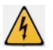
Electrical protection opening on overload or short-circuit (circuit breaker and fuse)

 Opening leakage current protection (DDR)

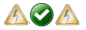 Individual fuse cartridge status indicator.

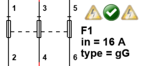 Example of a three-pole fuse holder with two fused cartridges.

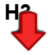Receiver underpowered 

Receiver overpowered
