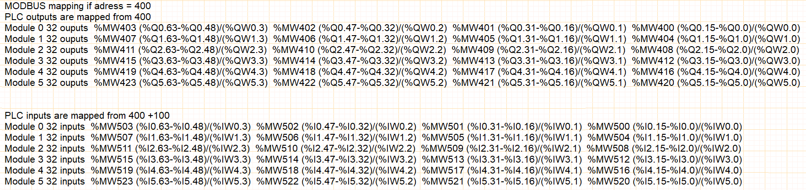
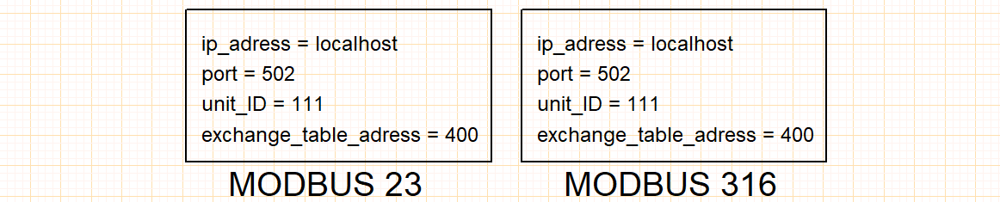

# Modbus/Tcp-IP 
## Preamble
- The simulator integrates the MODBUS/TCP-IP fieldbus protocol, a variant of the serial MODBUS proposed by MODICON since 1979.
- The TCP-IP variant encapsulates the MODBUS protocol in the Ethernet protocol.
- This encapsulation enables manufacturers to use MODBUS on any Ethernet hardware infrastructure.
- MODBUS TCP-IP offers decisive advantages:
    - it's the most widely used Industrial Ethernet protocol in the world,
    - its [specifications](assets/Modbus_Application_Protocol_V1_1b.pdf) are readily available,
- it is ideally suited to the rapid exchange of small quantities of data.

## MODBUS function codes supported
- code 03 (0x03) Read Holding Registers
    - This function code is used to read the contents of a contiguous block of PLC memory registers. The request specifies the start register address and the number of registers. In the request, registers are addressed starting from zero. Thus, registers numbered 1 to 16 are addressed as 0 to 15.
    - Register data in the response message is compacted as two bytes per register, with the binary content right-justified within each byte. For each register, the first byte contains the most significant bits and the second contains the least significant bits.

- code 16 (0x10) Write Multiple Registers
    - This function code is used to write a block of contiguous registers (1 to 123 registers) to PLC memory, specifying the values to be written in the request data field. The data is compacted to two bytes per register.
    - The normal response returns the function code, the start address and the number of registers written.

- code 23 (0x17) Read/Write Multiple Registers
    - This function code performs a combination of read and write operations in a single MODBUS transaction. The write operation is performed before the read operation.
    - PLC memory registers are addressed starting from zero. Thus, registers 1 to 16 are addressed in the PLC as 0 to 15.
    - The request specifies the start address and number of PLC registers to be read, as well as the start address, number of PLC registers and data to be written. The **WriteByteCount** field specifies the number of bytes that follow in the data field to be written.
    - The normal response contains the data from the group of registers that have been read. The **ByteCount** field specifies the number of bytes to follow in the read data field.
    

## MODBUS mapping

## MODBUS Configuration 

|                      |                                              ||
| -------------- | ------------------------------ ||
| ip_adress | localhost/127.0.0.1/xxx.xxx.xxx.xxx|IP address of PLC server|
| port | 502|standard MODBUS port|
| unit_ID | 111 | customer_id|
| exchange_table_address | 400 |pointer on exchange table|

- If the MODBUS configuration object is not set in your project, the default values used are: ip_address = local_host, port = 502, exchange_table_address = 400 and unit_ID = 111.
- The MODBUS configuration object is only required when a PLC is present in a folio.