# Programmable Logic Controller
## Preamble
- The simulator integrates a physical or virtual PLC into a folio.
- Communication with the PLC is carried out using the [Modbus/Tcp-IP] protocol (modbus.md) :
    - with the local IP address (127.0.0.1) of the Modbus server integrated into the virtual PLC,
    - with the static IP address of the Modbus server integrated into the physical PLC connected to an Ethernet network.
- This solution makes it possible to use the usual PLC programming tools.
- Exchange logic **client (master) (simulator) <-> server (slave) (api)**, periodically :
    - the Modbus client (simulator) sends a request to write the simulated SAP inputs to the Modbus server (PLC),
    - the PLC calculates the state of the SAP outputs according to its program and the state of the inputs received,
    - the Modbus client (simulator) sends a request to read the outputs calculated by the program to the Modbus server (PLC),
    - the simulator updates the SAP status.
- PLCs tested :
    - **M221** Schneider Electric function codes 3,16 and 23, integrated Modbus server
    -  M340** Schneider Electric function codes 3 and 16, integrated modbus server
    -  Unilogic** Unitronics function codes 3,16 and 23, Modbus server configuration required:

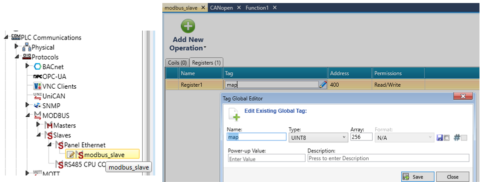
  

The example below uses **EcoStruxure Basic Expert from SchneiderElectric** to program and simulate M221 family PLCs.

## Elevator example
(fichiers us15 - demo_elevator_M221.xrs et us15 - demo_elevator_M221.smbp)

### WRsimulator Preparation :

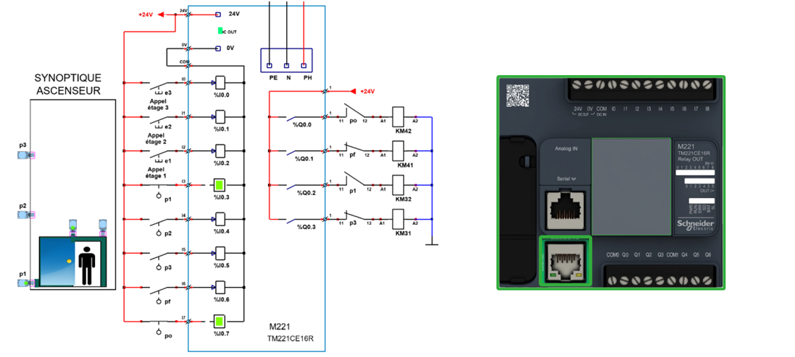

- Elevator control requires 8 digital inputs and 4 digital outputs. An M221 type TM221CE16R can be used, with 9 digital inputs and 7 relay outputs.
- Addressing of digital inputs: %I0.0, %I0.1, %I0.2, %I0.3, %I0.4, %I0.5, %I0.6, %I0.7, %I0.8
- Output addressing: %Q0.0, %Q0.1, %Q0.2, %Q0.3, %Q0.4, %Q0.5, %Q0.6
- This example implements 8 input objects and 4 output objects, identifying them with standard PLC addresses.

**Input assignment**

|                      |                                              |   |
| -------------- | ------------------------------ |--|
|address|mnemonic|comment|
| %I0.0|E3|appel étage 3|
|%I0.1|E2|appel étage 2|
|%I0.2|E1|appel étage 1|
|%I0.3|P1|cabine à létage 1|   
|%I0.4|P2|cabine à létage 2|   
|%I0.5|P3|cabine à létage 3|
|%I0.6|PF|porte cabine fermée|   
|%I0.7|PO|porte cabine ouverte|

**Output assignment** 

|                      |                              |   |
| -------------- | ------------------ |--|
|address|mnemonic|comment|
|%Q0.0|OUVRIR|Open door|   
|%Q0.1|FERMER|Close door
|%Q0.2|DESCENDRE|go down cab|
|%Q0.3|MONTER|go up cab|

### Preparation side EcoStruxure Machine Expert--Basic

The complete program **us15 - demo_elevator_M221.smbp** is available in the : 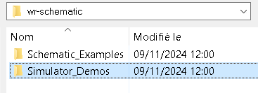

Mapping of input/output tables to the exchange table set at start address %MW400 [see modbus mapping](modbus.md):
  
|                      |                                    |   |   |
| -------------- | -----------------------|--|--|
|adress| MODBUS mapping|mnemonic|comment|
| %I0.0  |%MW500 :X0|E3|call stage 3|  
| %I0.1  |%MW500 :X1|E2|call stage 2|
| %I0.2  |%MW500 :X2|E1|call stage 1|
| %I0.3  |%MW500 :X3|P1|elevator cab on floor 1|
| %I0.4  |%MW500 :X4|P2|elevator cab on floor 2|
| %I0.5  |%MW500 :X5|P3|elevator cab on floor 3|
| %I0.6  |%MW500 :X6|PF|cab door closed|
| %I0.7  |%MW500 :X7|PO|cab door open|

|                      |                    |   |   |
| -------------- | ------------ |--|--|
|adress| MODBUS mapping|mnemonic|comment|
|%Q0.0|%MW400 :X0|OUVRIR|Open cab door|
|%Q0.1|%MW400 :X1|FERMER|Close cab door|
|%Q0.2|%MW400 :X2|DESCENDRE|go down cab|
|%Q0.3|%MW401 :X3|MONTER|go up cab|

In the **Programming ->Tools ->Symbols list** tab, you'll find the input/output assignments that correspond to the tables above:
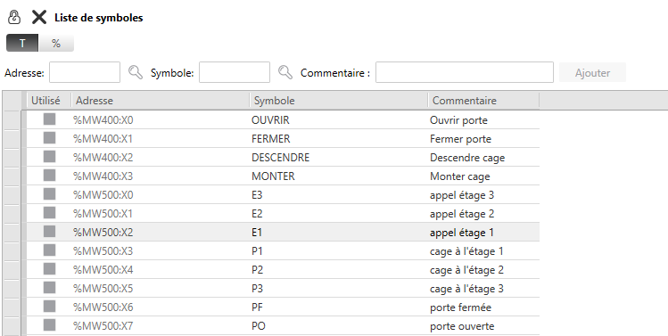

**PLC program**:
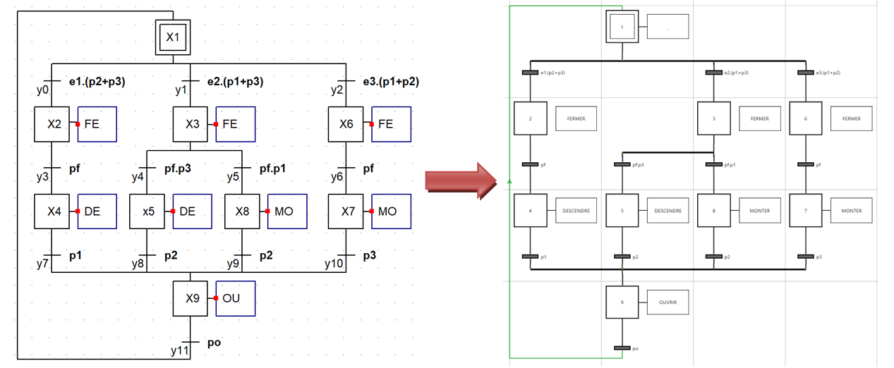
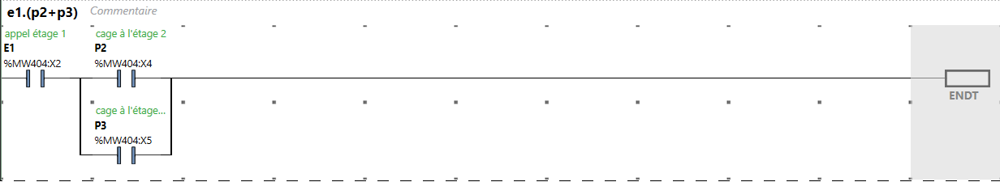
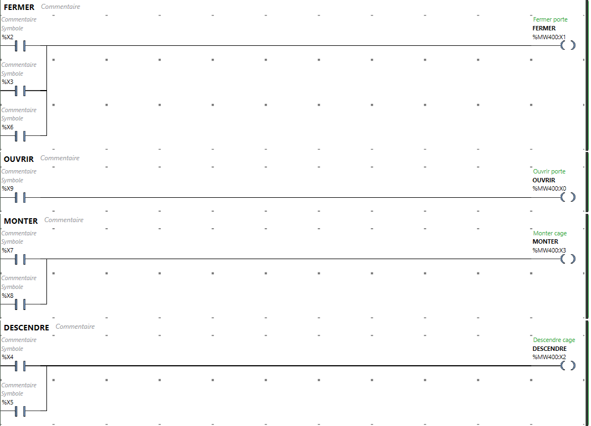

Start the controller **BEFORE** starting the simulator by activating the **Start simulation** and **Start controller** buttons in the EcoStruxure commissioning tab.

## Building a PLC object

- A PLC is built with the elementary objects :
    - input# for digital inputs,
    - output# for digital outputs,
    - analog_input# for analog inputs,
    - analog_output# for analog outputs,
    - plc_supply# for PLC power supply.
- All I/Os have the plc_supply object as their parent, in order to link the supply of these I/Os to the PLC power supply.
- The MODBUS server is implicitly attached to the PLC in place in the schematic.
- Only one PLC can be placed in the schematic.
- Examples of PLCs are available in the folder [blocs_simulables](library.md), using the WinRelais command 'Open a block'.

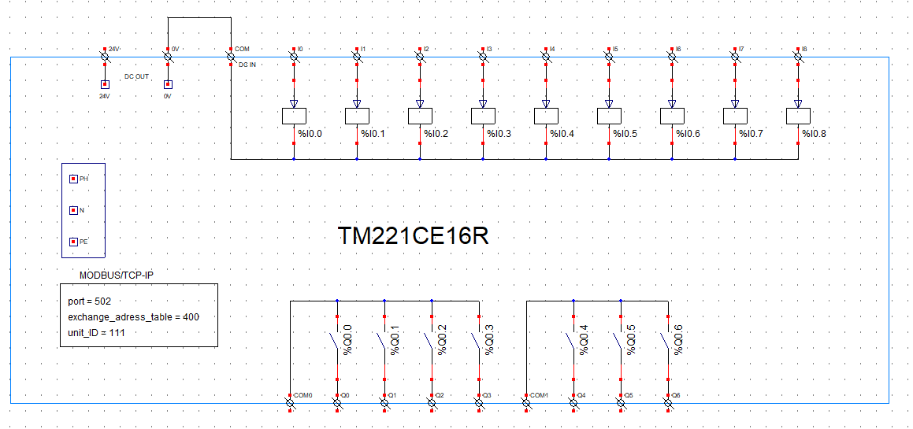
All these automaton footprints can be adjusted and modified as required.

## Entrées/Sorties logiques
|input, output|library _api|
| -----------------| -----------------------|
|%Ir.v or %Qr.v|r = [0,5] v = [0,31] |
|parent =         | object name **plc_supply#**|

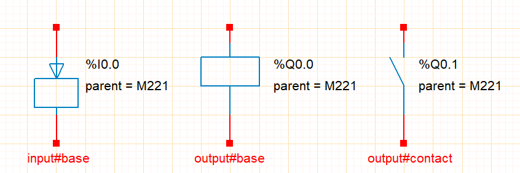

## Analog inputs
|analog_input|library _api|
| ---------------| ----------------------------------------------------------|
|%IWr.v           |r = [0,5] v = [0,3] |
|parent =         | object name **plc_supply#**|
|input_type =   | U  ou  I|
|input_range = |(min,max) V [-10,10] V or (min,max) mA [0, 20] mA|
|input_scale = |min,max   [-32768, 32767]|

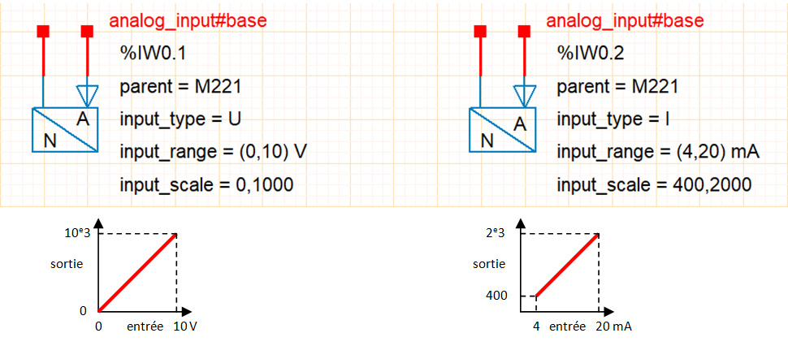

## Analog Outputs
|analog_output|library _api|
| ---------------| ---------------------------------------------------------|
|%QW0.0           |r = [0,5] v = [0,3]|
|parent =         |   object name **plc_supply#**|
|output_type =   | U  or  I|
|output_range = |(min,max) V [-10,10] V or (min,max) mA [0, 20] mA|
|output_scale = |min,max [-32768, 32767]|

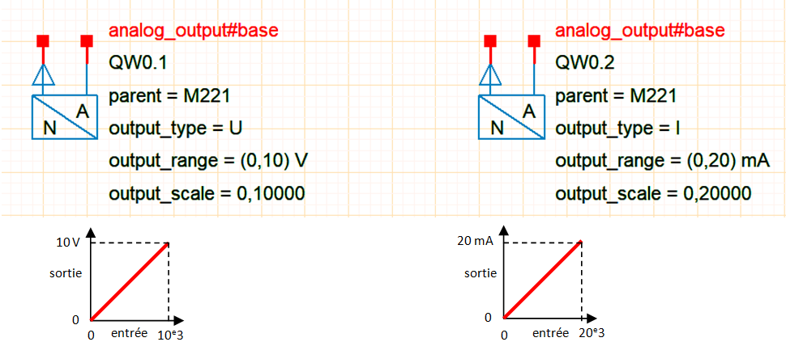
