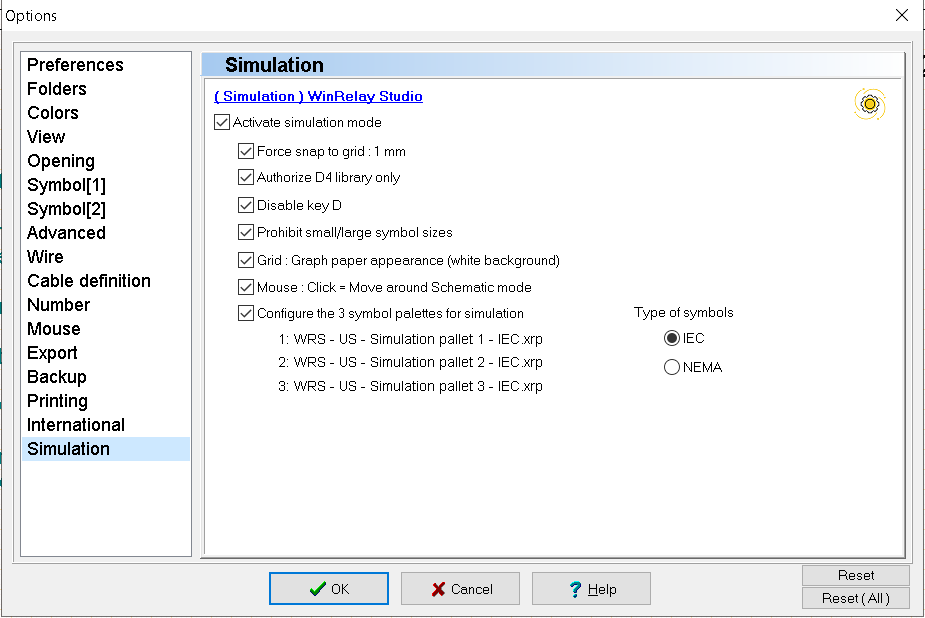
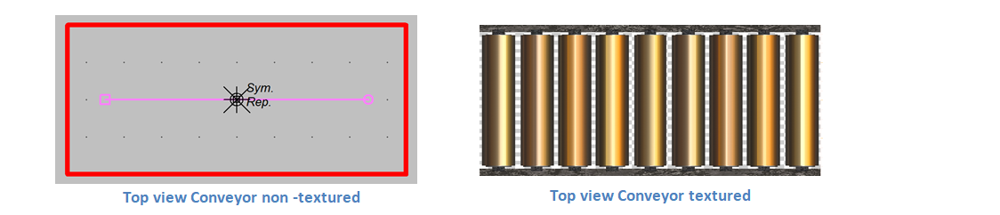
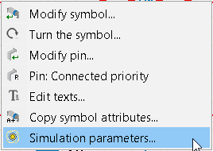
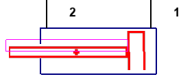
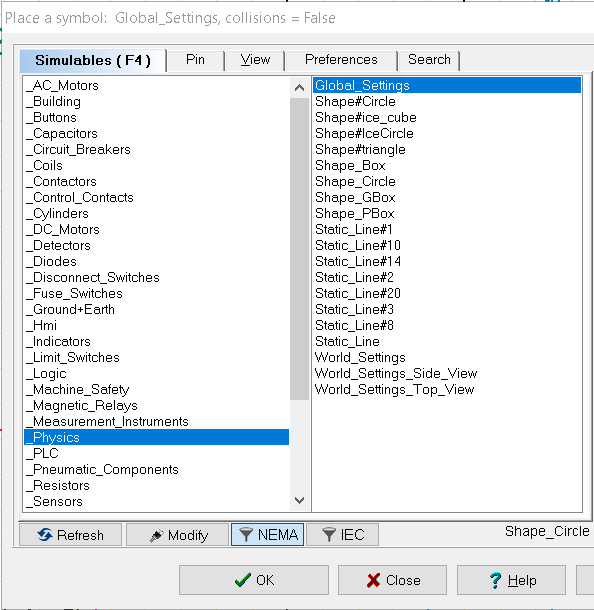
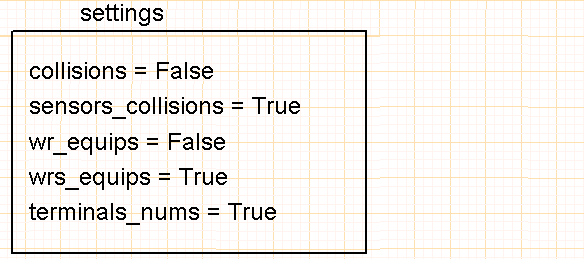
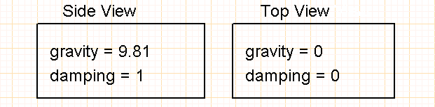

# Simulator
## WinRelay integration
- The simulator is active by default. Activation sets WinRelais to the following parameters (**Tools/Options**) :

- The **k** key displays/hides textures applied to simulatable objects:

- To launch the simulator, click on the icon:

- right-click on a simulation object to :
    - edit its properties,
    - rotate synoptic and cylinder objects to the nearest degree.

## Restrictions

### Numerical Model

- Mechanical loads applied to actuators (cylinders, motors) are fixed. They correspond to the actuators' nominal operating point.
- Current and voltage transients are not simulated.
- The maximum acquisition frequency of the measuring equipment is limited to 50Hz (1 measurement every 20 ms).
- Measurements are given in RMS or mean value only.

### drawing editing

- At present, there is no 'tool' for converting previous schematics into simulation schematics.
- Line width for conductors is fixed.
- Only the 'Arial' font is supported.
- Left' text alignment only.
- Bold and italic characters are transformed into normal characters.
- Frames and leaflets are not drawn in the simulator.
- Only one symbol size can be used: 'normal'.

### Editing symbols in WinSymbol

Some of the graphical features offered by WinSymbol are not taken into account by the simulator:
- No Bézier curve, no text, unfilled circle only,
- Fixed contour thickness
- No SVG graphics
- No background image
- No mini-drawings.

### Symbol editing anomaly

- 
- Occasionally, when a symbol is rotated in WinRelais, the collision texture and shape may shift. In this case, it is necessary to re-center the symbol's origin in WinSymbol.
  the symbol origin in WinSymbol (search keyword =  barycenter).
- It is preferable to carry out the rotation in WinSymbol, carefully adjust the barycenter and then save the symbol for reuse.

## General configuration blocks

This block adjusts certain display details of the current folio, and is mainly used for fine-tuning purposes:

- **collisions** = (False/True): displays collision patterns of physical objects,
- **sensors_collisions** = (False/True) : displays collision shapes of sensors and limit switches,
-  wrs_equips** = (False/True): displays equipotential numbers defined by the simulator,
-  wr_equips** = (False/True) : displays equipotential numbers defined in WinRelais,
-  terminals_nums** = (False/True) : displays device terminal numbers.

The **World_Settings** blocks define the behavior of the 2D physics engine. It is possible to adjust the motor in : 
- Top view: gravity is not taken into account,
- Side view: gravity is taken into account.
Only one **World_Settings** block can be placed per folio. It is possible to have different views from one folio to another, for example :
- one folio with a physical space described in top view,
- the next folio with a physical space described in side view.
The '**damping**' coefficient, between 0 and 1, simulates air friction on a moving object.