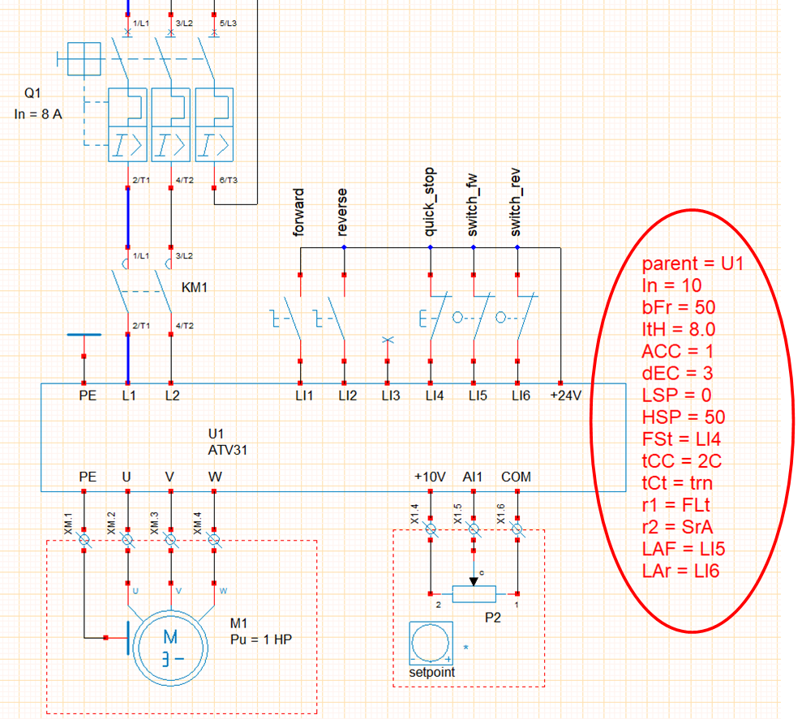

# Speed controller

## Preamble
WRsimulator can be used to insert variable speed drives into folios. The library currently includes SchneiderElectric ATV31 single-phase and three-phase drive objects.

Example **us18 - demo_Speed_Drive_ATV31_1ph_2C.xrs** illustrates the use of an ATV31 drive to control the speed of a moving table.

- the drive is attached to a text zone edited in WinRelais, which specifies its parameters,
- The first line of the text zone must begin with the command :
    - **parent =** drive name,
- This text zone can be placed anywhere in the diagram,
- If the text field does not exist, the drive is set to default parameters.

## ATV31 settings

[Schneider-Altivar-31-Programming.pdf](assets/Schneider-Altivar-31-Programming.pdf)

|Default settings |Description |
| ------------------ | ------------ |
|In = 10|Inverter calibration|
|bFr = 50|Standard motor frequency [50,60]|
|ItH = 10.0 |Motor thermal protection [0.2 to 1.5 In]|
|CLI = 15.0 |Current limitation [0.25 to 1.5 In]|
|ACC = 3.0 |Acceleration ramp time [0.1 to 3276 s]|
|dEC = 3.0 |Deceleration ramp time [0.1 to 3276 s]|
|LSP = 0 |Low speed [0 Hz to HSP]|
|HSP = 50 |High speed [LSP to bFR]|
|PS2 = n0 |2 preset speeds [n0,LI3,LI4,LI5,LI6]|
|PS4 = n0 |4 preselected speeds [n0,LI3,LI4,LI5,LI6]|
|PS8 = n0 |8 preselected speeds [n0,LI3,LI4,LI5,LI6]|
|SP2 = 10 |Preset speed 2 [0 Hz to HSP]|
|SP3 = 15 |Preset speed 3 [0 Hz to HSP]|
|SP4 = 20 |Preset speed 4 [0 Hz to HSP]|
|SP5 = 25 |Preset speed 5 [0 Hz to HSP]|
|SP6 = 30 |Preset speed 6 [0 Hz to HSP]|
|SP7 = 35 |Preset speed 7 [0 Hz to HSP]|
|SP8 = 40 |Preset speed 8 [0 Hz to HSP]|
|tCC = 2C |Control 2wire / 3wire [2C, 3C]|
|tCt = trn |Control type 2wire [LEL, trn, PFO]|
|r1 = FLt |Relay r1 [n0,FLt,rUn,FtA,FLA,CtA,SrA,tSA,APL,LI1,LI2,LI3,LI4,LI5,LI6]|
|r2 = n0 |Relay r2 [n0,FLt,rUn,FtA,FLA,CtA,SrA,tSA,bLC,APL,LI1,LI2,LI3,LI4,LI5,LI6]|
|FSt = n0 |Fast stop on logic 0 [n0, LI1, LI2, LI3, LI4, LI5, LI6]|
|LAF = n0 |Forward limit switch [n0, LI1, LI2, LI3, LI4, LI5, LI6]|
|LAr = n0 |Stroke end forward [n0, LI1, LI2, LI3, LI4, LI5,LI6]|
|LAS = nSt |Stop type at end of stroke [rMP, FSt, nSt]|
|FR1 = AII|Setpoint 1 configuration [AII, AI2, AI3]|

## ATV11 settings

[ATV11_UserManual.pdf](assets/ATV11_UserManual.pdf)

|default settings |Description |
| ------------------ | ------------ |
|In = 10|Inverter calibration|
|bFr = 50|Standard motor frequency [50,60\]|
|ItH = 10.0 |Motor thermal protection [0.2 to 1.5 In]|
|CLI = 15.0 |Current limitation [0.25 to 1.5 In]|
|ACC = 3.0 |Acceleration ramp time [0.1 to 3276 s]|
|dEC = 3.0 |Deceleration ramp time [0.1 to 3276 s]|
|LSP = 0 |Low speed [0 Hz to HSP]|
|HSP = 50 |High speed [LSP to bFR]|
|SP2 = 10 |Preset speed 2 [0 Hz to HSP]|
|SP3 = 25 |Preset speed 3 [0 Hz to HSP]|
|SP4 = 50 |Preset speed 4 [0 Hz to HSP]|
|Alt = 5U| Analog input configuration [5U, 10U, 0A, 4A]|
|ACt = 2C|2-wire / 3-wire control [2C, 3C]|
|tCt = trn | 2-wire control type [LEL, trn, PFO]|
|rrS = n0|Rear direction [n0,LII,LI2,LI3,LI4]|
|LIA = n0|LIA input assignment [n0,LII,LI2,LI3,LI4]|
|LIb = n0|Input assignment LIb [n0,LII,LI2,LI3,LI4]|
|dO = n0|[n0, 0Cr, rFr, FtA, SrA CtA]|
|Ftd = 50|Threshold frequency (0 to 200 Hz)|
|Ctd = 10|Current threshold [0 to 1.5 In]|