# Synoptic

## Preamble
 The simulator allows you to create small operative parts that can be controlled with the actuators
of the schematic. It integrates a 2D physics engine to bring a certain realism to the simulation. Example:

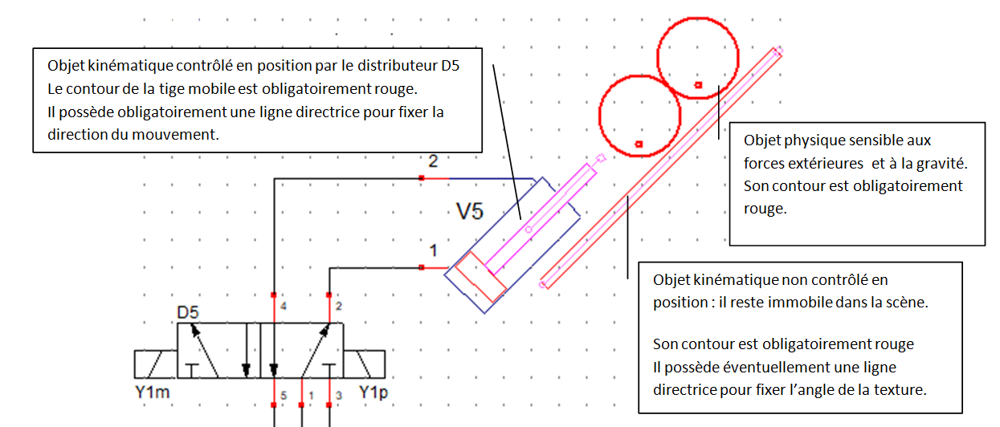

This example shows two cylindrical drums on an inclined ramp, seen from the side. When the cylinder rod extends, the two drums are raised to the top of the ramp.
When the cylinder rod retracts, the two drums roll (or slide, depending on the coefficient of friction applied) down the ramp, finally being locked in position by the cylinder nose.
Two types of objects are used by the physical motor:
- physical objects, which are subject to external forces and gravity. In particular, they have a mass in kilograms
- kinematic objects, whose positions in the scene are controlled directly by the program. They are insensitive to external forces and therefore not subject to the laws of physics. Physical objects can collide with kinematic objects.

## Physical object settings

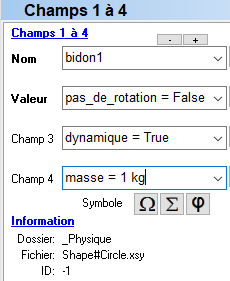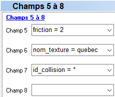

|shape|library|Physics|
| ---------------| ----------------------------------------------------------------------------------------|
|dynamic =| True -\> object is of type 'physical', False -\> object is of type 'kinematic'|
|masse =| mass in kg of the physical object \[1 to 100 kg]|
|friction =| coefficient of friction \[0 to 100\] applied to the physical object|
|pas_de_rotation =| applies a considerable mass and inertia value to the physical object|
|id_collision =| * (default value)|
|texture_name =|image name ( **png** format only)|
- if **dynamics** = False, parameters **mass** and **friction** are ignored.

##Kinematic object settings
|kinematic|library|_Synoptic|
| ---------------| ----------------------------------------------------------------------------------------|
|parent =|designates a parent that can only be a sliding link|
|id_collision =| * (default value)|
|texture_name =|name of the image that can be applied to the object ( **png** format only)|
|show =|True (False or True) show/hide object|
- A kinematic object can be attached to a sliding link.
- The **show** parameter allows the use of invisible 'walls'.

## Detector and limit switch
Detects physical and kinematic objects that enter the sensor/end-of-travel detection zone
- A sensor is a specialized kinematic object available in the **_Synoptique** library.
|sensor|library|_Synoptic|
|-----------|--------------------------------------|
|parent =| designates a parent that can only be a sliding link|
|id_collision =| * (default value, detects all objects present in the detection zone)|
|texture_name =|name of the image that can be applied to the object ( **png** format only)|
|* =|fixes the position of the indicator light (green square)|* =|fixes the position of the indicator light (green square)

- A detector with id_collision = * detects all objects entering its detection zone.
-  id_collision** is used to filter objects detected by a detector or limit switch component. For example :
  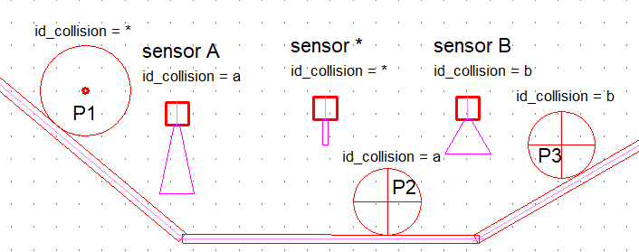
  
|Collision Object Filtering|
| ----------------------------------------------|
|sensor A detects only object P2|
|sensor * detects objects P1, P2 and P3|
|sensor B detects only object P3|
- A sensor's detection zone is defined by a **magenta (255,0,255)** color contour.
  (255,0,255) . For example :
  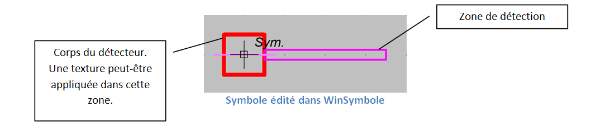 

- If a texture name is defined, the application searches for the texture (in **png** format only) in the folder
  **C:\\Users\\Public\\Documents\\Elec-CAO\\wrs-data\\textures**
- If the texture name is not defined, or if the texture file is not found, a texture calculated by the program will be applied to the object using
the outer edge coloured **red**. For example:
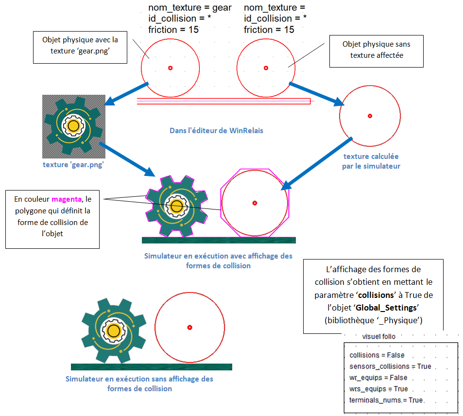
 

The texture silhouette automatically defines the object's collision shape.
    - The physics engine uses the transparent part of the texture to delimit the collision shape in the form of a **convex** polygon, as shown below:
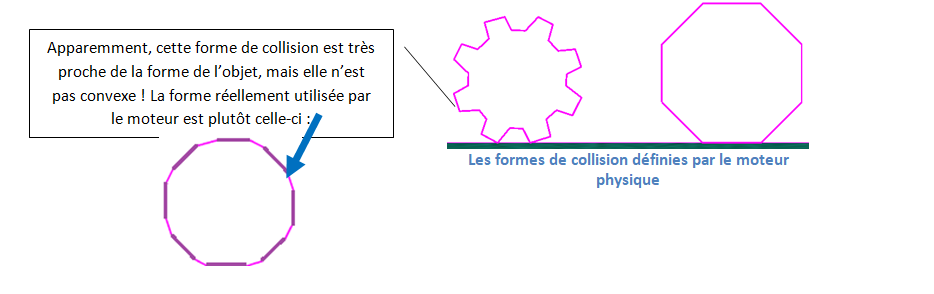

- Drawing constraint in **WinSymbol**.
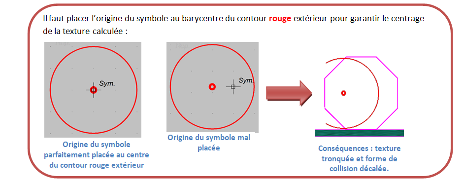

## Slider links
Slider links are available in the **\_Synoptique** library and are prefixed with the slider keyword:
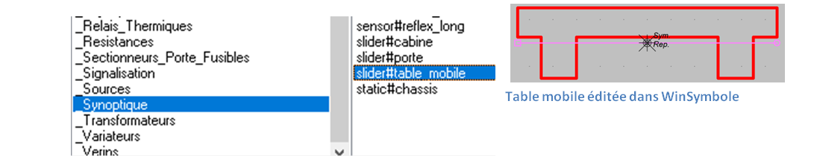

- Description of slider parameters:

|slider |library|_Synoptic|
| ---------------| ----------------------------------------------------------------------------------------|
|controle_direction =| designates the motor object used to control the mobile in direction|
|speed_control =| designates the motor object used to control the mobile in speed|
|speed =|speed in % of motor speed (transcribed as linear speed). \[0 à100%\]|
|friction =|fixes the friction of the motor surface \[0 to 100\]|
|id_collision =| * (default value, detects any object that collides)|
|parent =| designates a parent which can only be another sliding link|
|texture_name =| name of the texture that can be applied to the mobile.

- Elements of a sliding connection that can be edited in WinSymbol :
- These elements are differentiated in WinSymbol by specific colors:
        - **(255,128,255)** identifies the guideline and limits of movement (square and circle symbols),
        - (255,0,0)** identifies the outer contour of the mobile. This contour must be a single convex polygon,
        - (255,0,255)** identifies the optional collision shape, which must be a single convex polygon. If this polygon is not defined, the physics engine calculates the collision shape from the red outer contour.
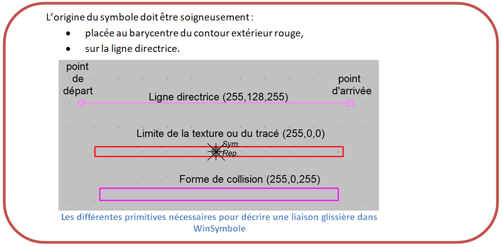

- Examples
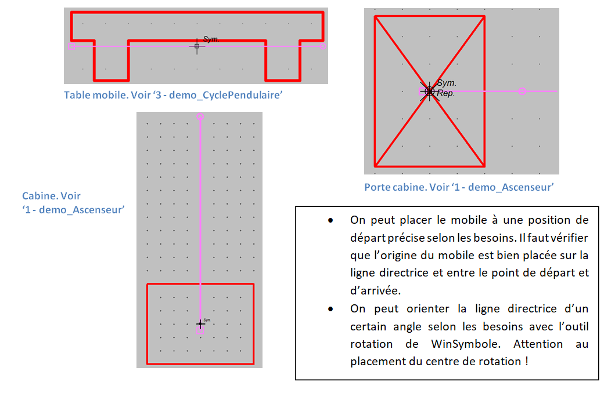

## Cylinder actuator
A cylinder is a specialized sliding link.

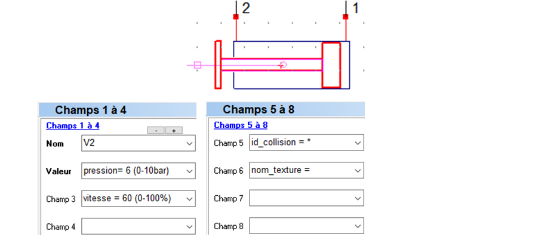

|VerinSE, VerinDE|library \_Verins|
| ---------------| ---------------------------------------------------------------------|
|pressure =|nominal pressure [0 to 10 bar]|
|speed =|speed coefficient of rod movement [0 to 100%]|
|id_collision =| * (default value, detects any object colliding with it)|
|texture_name =| name of texture that can be applied to the rod|

## Floating cylinder actuator
Identical to the cylinder component, except that it can be attached to a sliding link.

 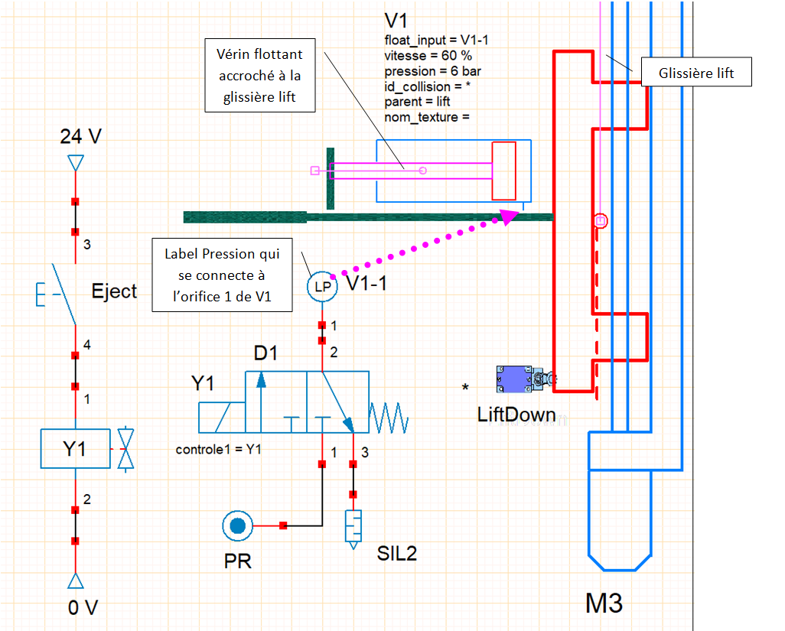

- It is systematically associated with :
    - a **Label_Pression** object for single-acting cylinders,
    - two **Label_Pression** objects for double-acting cylinders.
  - The names of **Label_Pression** objects are used in the **float_inputs** (or **float_input**) parameter to connect cylinder ports.

|VerinDE_flottant |  library \_Verins |
| ---------------| ---------------------------------------------------------------------|
|float_inputs = |(Label_Pression orifice 1, Label_Pression orifice 2)|
|parent =| designates a parent which may be just another slide link|
|pressure =|nominal pressure [0 to 10 bar]|
|speed =|speed coefficient of rod movement [0 to 100%]|
|id_collision =| * (default value, detects any object colliding with it)|
|texture_name =| name of the texture that can be applied to the rod|

| VerinSE_flottant | library \_Verins |
| ---------------| ---------------------------------------------------------------------|
|float_input = |Label_Pression orifice 1|
|parent =| designates a parent which may be just another slide link.
|pressure =|nominal pressure [0 to 10 bar]|
|speed =|speed coefficient of rod displacement|

## Sliding link and kinship
All kinematic objects can be attached to a sliding link. This is extremely useful for creating non-convex collision shapes, for example :

The rod nose is a kinematic object attached to the cylinder rod through the parent parameter :
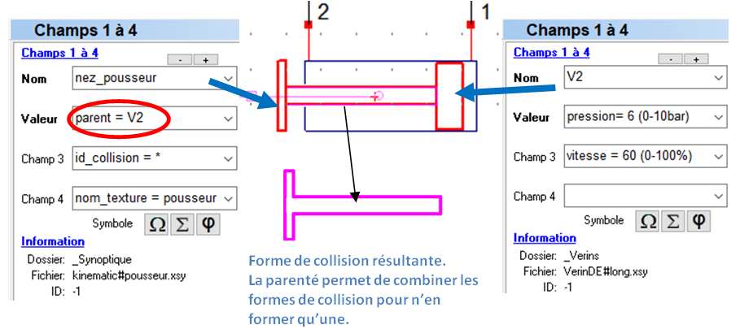

Several kinematic objects can be attached:
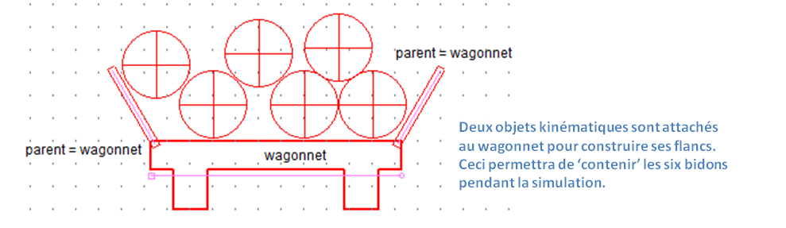

## Top view conveyor
Top-view conveyors are available in the **\_Synoptique** library and are prefixed with the **conveyor** keyword:
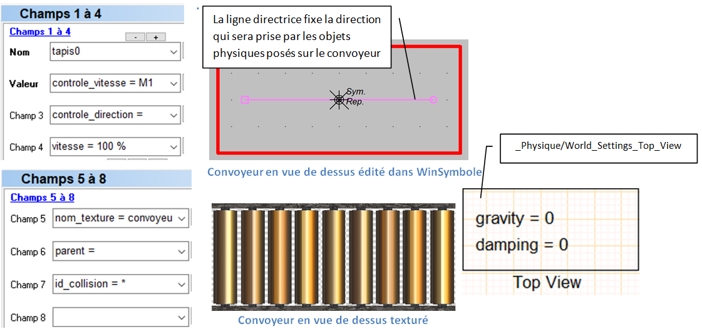

|conveyor | library \\_Synoptic|
| ---------------| ---------------------------------------------------------------------|
|controle_direction =|motor object used to control conveyor diection|
|control_speed =|motor object used to control speed|
|speed =|conveyor speed as % of motor speed (transcribed as linear speed). \[0 à 100%\]|
|friction =|fixes conveyor friction \[0 to 100\]|
|id_collision =| * (default value)|
|parent =| designates a parent that can only be a sliding link|
|texture_name =| name of the texture that can be applied to the conveyor|

## Side view conveyor
Side-view conveyors are available in the **\_Synoptique** library and are prefixed with the **side_conveyor** keyword:
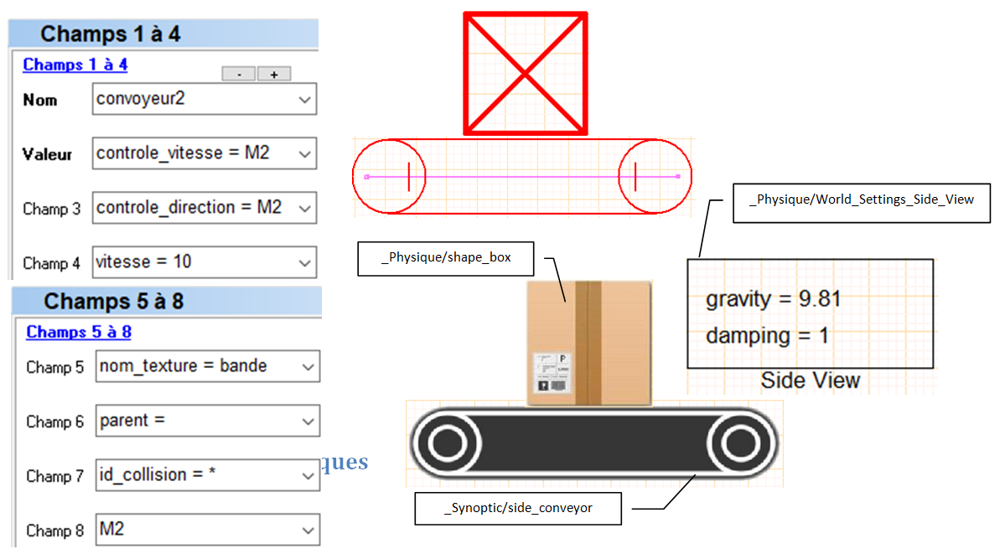

|side_conveyor|library \\_Synoptic|
| ---------------| ---------------------------------------------------------------------|
|control_direction =|motor object used to control conveyor diection|
|speed_control =|motor object used to control speed|
|speed =|conveyor speed as % of motor speed (transcribed as linear speed). \[0 à 100%\]|
|friction =|fixes conveyor friction \[0 to 100\]|
|id_collision =| * (default value)|
|parent =| designates a parent that can only be a sliding link|
|texture_name =| name of the texture that can be applied to the conveyor|

## Object dispenser
See **38 - demo_Convoyeurs.xrs**

Specialized synoptic object used to distribute a physical object in the scene at regular intervals.
- At least one copy of the object to be distributed must be placed in the scene.
- The number of objects distributed is limited to 16.

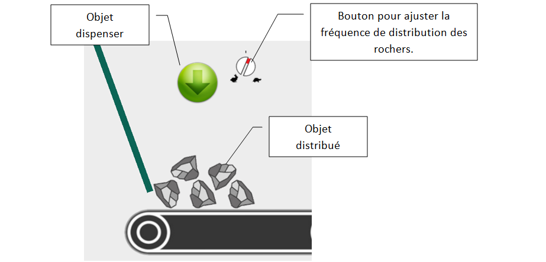

|dispenser|library \\_Synoptic|
| ---------------| ---------------------------------------------------------------------|
|id_collision =| * (default value)|
|parent =| designates a parent that can only be a sliding link|
|texture_name =| name of the texture that can be applied to the dispenser|
|dropped_object =|name of distributed physical object|
|*| sets the dispense point|
|delay =|dispensing interval in seconds [0.1 s to 30 s]|
|show =|True (False or True) show/hide object|

- if **dispenser** is associated with a potentiometer button, the dispensing interval is adjustable between 0.1 s and **delay**.

## Synoptic assemblies
Complete synoptics can be saved and retrieved using WinRelais' block commands.
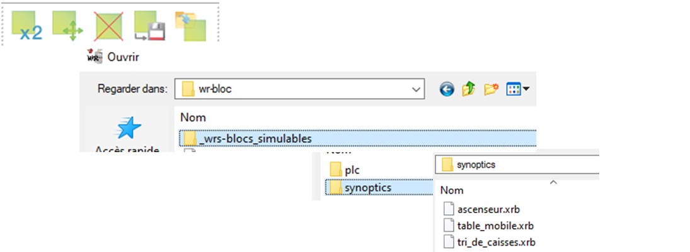

synoptic example imported **tri_de_caisses**:
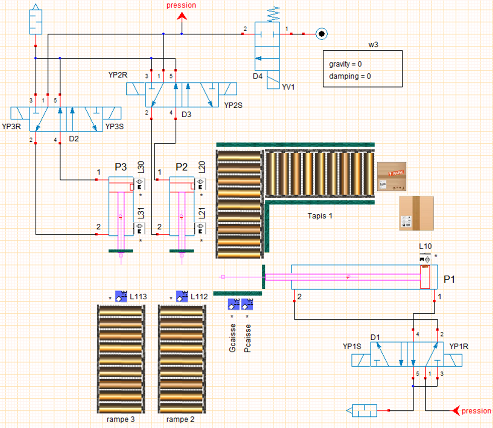
