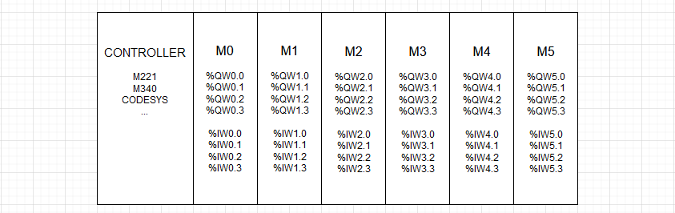

# Contrôleur d'axe

## Préambule
WRsimulateur permet d'insérer des contrôleurs d'axe dans les folios. le controleur d'axe simulé est une implémentation partielle du contrôleur d'axe SCONS2 de la société IAI. [SCON2-CE0401-1.1A.pdf](assets/SCON2-CE0401-1.1A.pdf)

L'exemple **43-demo_controleur_axe_CODESYS.xrs** illustre la mise en œuvre d'un contrôleur d'axe **IAI-SCON2** pour contrôler le positionnement dune table élévatrice.

### Simulation contrôleur d'axe CODESYS 

### Description

- L'automate virtuel CODESYS ControlWin 64 est connecté au contrôleur d'axe  simulé par WRSimulateur via Modbus TCP-IP.
- L'interaction entre l'automate et le contrôleur passe par une table d'échange qui comprend 5 mots. (%QW5.0 à %QW5.2 et %IW5.0 à %IW5.1 dans l'exemple)
- Le programme du projet **43-demo_controleur_axe_CODESYS.project** ajuste les bits de contrôle du registre **axis_ctrl** du contrôleur selon l'état des boutons connectés à ses entrées.
- La vitesse et le point de consigne sont imposés par le programme (lignes 9 et 10 du programme ci-dessous)
- On peut tester le comportement du positionnement de la table mobile en forçant les valeurs des registres **axis_setpoint** et **axis_speed**
- Le contrôleur d'axe intègre un asservissement de position PID. Les paramètre Proportionnel, Intégral et Dérivé sont ajustables avec les boutons Kp, Ki et Kd.
- On peut observer avec le grapheur la  position de l'axe en utilisant la variable spécifique **axis_position**.

### Programme contôleur d'axe CODESYS

## Paramètres

Les adresses des mots API utilisés dans les tableaux suivants sont donnés à titre d'exemple. Il est possible de choisir des adresses différentes dans la cartographie de l'API virtuel:

|Paramètre par défaut      |Description                    |
| ------------------ | ------------ |
|In = 10 A|Calibre du contrôleur d'axe|
|axis_ctrl = %QW5.0|Bits de contrôle|
|axis_setpoint = %QW5.1 |Consigne de position |
|axis_speed = %QW5.2 |Vitesse de déplacement de l'axe en %|
|axis_status = %IW5.0 |Statut du conrôleur d'axe|
|axis_position = %IW5.1 |Position de l'axe en %|
|home_point = 0 mm |Valeur de la position du point home en mm|
|max_position = 700 mm |Valeur de la position du point max en mm|

|axis_ctrl      |Description des bits                    |
| ------------------ | ------------ |
|set servo (%QW5_0.0)|Autorise le fonctionnement du contrôleur d'axe [False,True]|
|stop move (%QW5_0.1)|Demande l'arrêt du mouvement [False,True]|
|goto home (%QW5_0.2)|Demande le retour à la position home [False,True]|
|goto setpoint (%QW5_0.3)|Demande le positionnement au point de consigne [False,True]|
|raz default (%QW5_0.4)|Demande la RAZ des défauts (surcharge) [False,True]|

|axis_status      |Description  des bits                 |
| ------------------ | ------------ |
|setpoint_reached (%IW5.0)| La position de consigne est atteinte [False,True]|
|homepoint_reached (%IW5.1)| La position Home est atteinte [False,True]|
