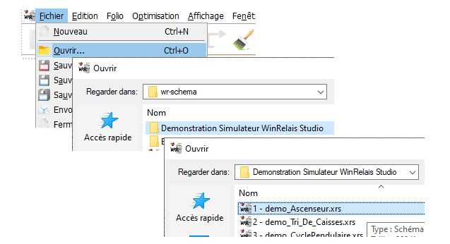
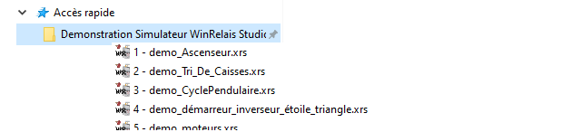
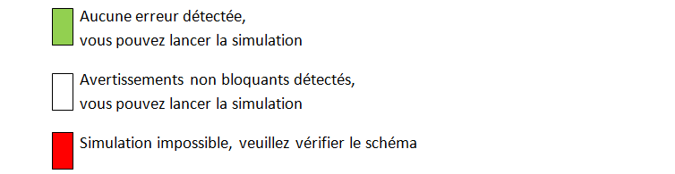

# Accueil

|                      |                                              |
| -------------- | --------------------------------------------- |
| **Révision 4** |  **septembre 2025** |
| Logiciel       | WRSimulateur|
| Version        | 1.6 on WinRelay Studio 2.5.2 (2.5g) |
| Editeur        | INGEREA |

## Objectifs du simulateur

L'objectif du simulateur est de permettre aux utilisateurs de simuler des circuits électriques, électrotechniques et pneumatiques pour un usage pédagogique et de présentation en avant-projet.

Le simulateur permet notamment la simulation d'installations de type SAP (Système Automatisé de Production) en utilisant un automate programmable virtuel ou physique connecté en MODBUS/TCP-IP, couplé à une partie opérative animée.

Le simulateur intègre un modèle de simulation mixte analogique/numérique qui permet la simulation simultanée
- de circuits électriques/électrotechniques standards,
- de circuits pneumatiques,
- d'objets complexes (variateurs de vitesse, relais de sécurité, etc.)
- d'automates programmables,
- de parties opératives simples

## Premiers pas
### Ouvrir un exemple
Deux possibiltés:

- Ouvrir un exemple à partir de WinRelais **Fichier>Ouvrir  wr-schema/Demonstration Simulateur WinRelais Studio/**:

- Un **accès rapide** au dossier **Demonstration Simulateur WinRelais Studio** est construit à l'installation.
Il est ainsi possibble de lancer directement WinRelais avec l'exemple sélectionné :

### Lancer le simulateur
En cliquant sur l'icône:

### Contrôles réalisés par le simulateur
- Les contrôles réalisés par le simulateur donnent trois niveaux d'avertissement :

[Liste des avertissements](errors.md)

