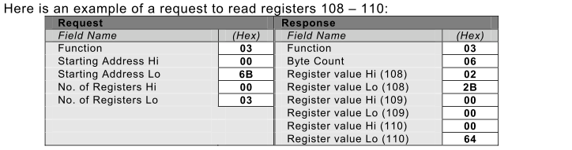
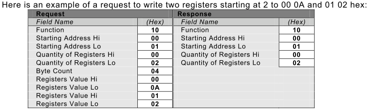
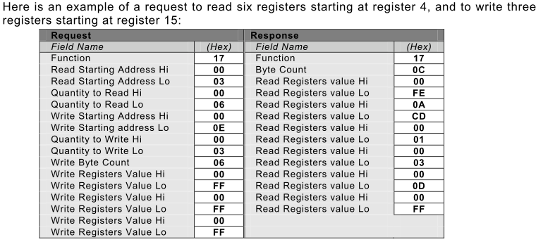
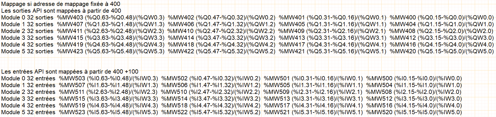
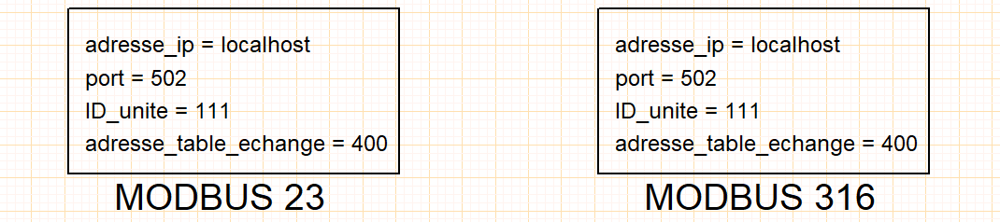

# Modbus/Tcp-IP 
## Préambule
- Le simulateur intègre le protocole bus de terrain MODBUS/TCP-IP qui est une variante du MODBUS série proposé par la société MODICON depuis 1979.
- La variante TCP-IP encapsule le protocole MODBUS dans le protocole Ethernet.
- Cette encapsulation permet aux constructeurs d'utiliser MODBUS sur toute l'infrastructure matérielle Ethernet

- MODBUS TCP-IP présente des avantages déterminants :
    - c'est le protocole Ethernet Industriel le plus employé dans le monde,
    - les [spécifications](assets/Modbus_Application_Protocol_V1_1b.pdf) sont facilement disponibles, 
    - il est taillé pour réaliser l'échange rapide de petites quantités de données.

## Codes fonction MODBUS supportés
- code 03 (0x03) Read Holding Registers
    - Ce code de fonction est utilisé pour lire le contenu d'un bloc contigu de registres de la mémoire automate. La requête spécifie l'adresse du registre de départ et le nombre de registres. Dans la requête, les registres sont adressés en commençant à zéro. Ainsi, les registres numérotés de 1 à 16 sont adressés comme 0 à 15.
    - Les données des registres dans le message de réponse sont compactées sous forme de deux octets par registre, avec le contenu binaire justifié à droite dans chaque octet. Pour chaque registre, le premier octet contient les bits de poids fort et le second contient les bits de poids faible .

- code 16 (0x10) Write Multiple Registers
    - Ce code de fonction est utilisé pour écrire un bloc de registres contigus (1 à 123 registres) dans dans la mémoire automate.Les valeurs à écrire sont spécifiées dans le champ de données de la requête. Les données sont compactées sous forme de deux octets par registre.
    - La réponse normale renvoie le code de fonction, l'adresse de départ, et la quantité de registres écrits.

- code 23 (0x17) Read/Write Multiple Registers
    - Ce code de fonction effectue une combinaison d'une opération de lecture et d'une opération d'écriture dans une seule transaction MODBUS. L'opération d'écriture est effectuée avant l'opération de lecture.
    - Les registres de la mémoire automate sont adressés en commençant à zéro. Ainsi, les registres 1 à 16 sont adressés dans l'automate comme 0 à 15.
    - La requête spécifie l'adresse de départ et le nombre de registres de la mémoire automate à lire, ainsi que l'adresse de départ, le nombre de registres de la mémoire automate et les données à écrire. Le champ **WriteByteCount** spécifie le nombre d'octets qui suivent dans le champ de données à écrire.
    - La réponse normale contient les données du groupe de registres qui ont été lus. Le champ **ByteCount** spécifie la quantité d'octets à suivre dans le champ de données lues.

## Mappage MODBUS

## Configuration MODBUS

|                      |                                              ||
| -------------- | ------------------------------ ||
| adresse_ip | localhost/127.0.0.1/192.168.0.10|adresse IP du serveur API|
| port |   502|port normalisé MODBUS|
| ID_unite |  111 |identifiant du client|
| adresse_table_echange |  400 |pointeur sur la table d'échange|

- Si l'objet de configuration MODBUS n'est pas placé dans votre projet, les valeurs utilisées par défaut sont : adresse_ip = local_host, port = 502, adresse_table_echange = 400 et ID_unite = 111.

- L'objet de configuration MODBUS est requis  uniquement lorsqu'un automate programmable est présent dans un folio.