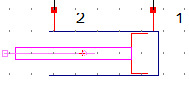
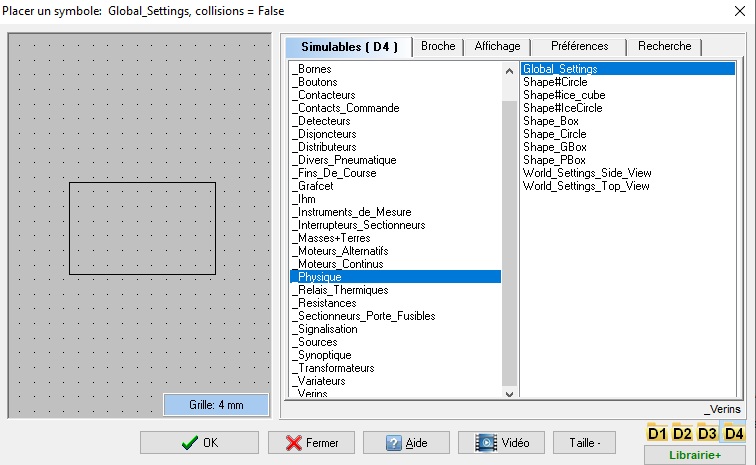
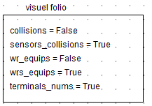
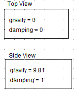

# Simulateur
## Intégration dans WinRelais
- Le simulateur est actif par défaut. L'activation paramètre WinRelais avec les réglages suivants (**Outils/Options**) :

- La touche clavier **k** permet d'afficher/cacher les textures appliquées aux objets simulables :

- Le lancement du simulateur est réalisé en cliquant sur l'icône :

- un clic droit sur un objet simulable permet :
    - d'éditer ses propriétés,
    - d'effectuer une rotation au degré près des objets synoptiques et vérins.

## Restrictions

### Modèle numérique

- Les charges mécaniques appliquées aux actionneurs (vérins, moteurs) sont fixes. Elles correspondent au point de fonctionnement nominal des actionneurs.
- Les transitoires des courants et des tensions ne sont pas simulées.
- La fréquence maximale d'acquisition des appareils de mesure est limitée à 50Hz (1 mesure toutes les 20 ms).
- Les mesures sont données uniquement en valeur efficace ou moyenne.

### Edition des schémas

- Il n'existe pas pour l'instant de 'moulinette' pour convertir des schémas antérieurs en schémas simulables.
- L'épaisseur des traits pour les conducteurs est fixe.
- Seule la police de caractères 'Arial' est supportée.
- L'alignement de texte supporté est 'gauche' uniquement.
- Les caractères gras et italiques sont transformés en caractères normaux.
- Les cadres et les cartouches de folio ne sont pas dessinés dans le simulateur.
- Une seule taille de symbole est utilisable : la taille 'normale'.

### Edition des symboles dans WinSymbole

Certaines fonctionnalités graphiques proposées par WinSymbole ne sont pas prises en compte par le simulateur :

- Pas de courbe de Bézier, ni de texte, cercle non rempli uniquement,
- Epaisseur des contours fixe
- Pas de graphique SVG
- Pas d'image d'arrière plan
- Pas de mini-dessin.

### Anomalie d'édition d'un symbole

- 
- Il peut arriver qu'un décalage de la texture et de la forme de collision survienne suite à la rotation d'un symbole dans WinRelais. Il est alors nécessaire de recentrer
  l'origine du symbole dans WinSymbole. (mot-clé de recherche =  barycentre)
- Il est préférable de mener la rotation plutôt dans WinSymbole, d'ajuster avec soin le barycentre puis de sauver le symbole pour réutilisation.

## Blocs de configuration généraux

Ce bloc ajuste certains détails d'affichage du folio courant, il est essentiellement utilisé à des fins de mise au point :

- **collisions** = (False/True) : visualise les formes de collision des objets physiques,
- **sensors_collisions** = (False/True) : visualise les formes de collision des détecteurs et des fins de course,
- **wrs_equips** = (False/True) : visualise les numéros des équipotentiels définis par le simulateur,
- **wr_equips** = (False/True) : visualise les numéros des équipotentiels définis dans WinRelais,
- **terminals_nums** = (False/True) : visualise les numéros de bornes des appareils.

Les blocs **World_Settings** définissent le comportement du moteur physique 2D. Il est possible d'ajuster le moteur en :

- vue de dessus (Top view) : la gravité n'est pas prise en compte,
- vue de côté (Side view) : la gravité est prise en compte.

On ne peut placer qu'un seul bloc **World_Settings** par folio. Il est possible d'avoir des vues différentes d'un folio à l'autre, par exemple :

- un folio avec un espace physique décrit en vue de dessus,
- le folio suivant avec un espace physique en vue de côté.

Le coefficient de '**damping**', compris entre 0 et 1, simule la friction de l'air qui s'exerce sur un mobile.